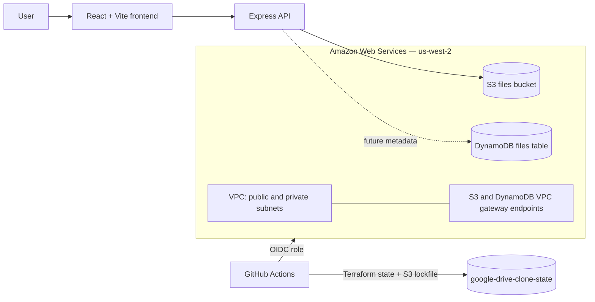

# Google Drive Clone

A learning project for a file-storage application on AWS. The repository contains a React/Vite frontend, an Express API for file operations, and Terraform infrastructure.

> The API currently stores file objects in S3. Terraform also provisions a DynamoDB table for future file-metadata use; the API does not yet read or write that table.

## Architecture



## Repository layout

| Path | Purpose |
| --- | --- |
| `frontend/` | React 19 and Vite frontend (currently a starter UI). |
| `server/` | Express and TypeScript API that performs S3 file operations. |
| `terraform/` | AWS infrastructure: VPC, S3, DynamoDB, VPC endpoints, IAM group, and remote-state backend configuration. |
| `.github/workflows/terraform.yml` | Terraform CI/CD workflow. |

## API

The server listens on port `3000` by default.

| Method | Path | Description |
| --- | --- | --- |
| `GET` | `/api/v1/health` | Health check. |
| `GET` | `/api/v1/files?prefix=…` | List immediate files and directories under the required prefix with `key`, `name`, `isDirectory`, and file metadata. |
| `GET` | `/api/v1/files/presigned-url?key=…` | Get a presigned download URL for one object (valid for 15 minutes). |
| `GET` | `/api/v1/files/object?key=…` | Download one object. |
| `POST` | `/api/v1/files` | Upload an object; JSON body requires `key` and base64 `content`. |
| `PUT` | `/api/v1/files` | Replace an object using the same request body. |
| `DELETE` | `/api/v1/files?key=…` | Delete an object. |
| `POST` | `/api/v1/files/rename` | Rename a file or directory within its parent; JSON body requires `key` and `name`. |

The API root and health endpoint are available at `/api/v1/` and `/api/v1/health`.
Use a prefix ending in `/` to browse a directory. Directory entries appear in the
`files` array with `isDirectory: true` and a key ending in `/`; pass that key as
the next prefix to list its contents. Both empty folders and folders implied by
nested objects are included. Pagination totals count both files and directories.
For local development, the API allows requests from `http://localhost:5173`. Set `CORS_ORIGIN` on the server to a comma-separated list of allowed frontend origins when using a different host or port.

For uploads, `contentType` is optional. Example payload:

```json
{
  "key": "documents/hello.txt",
  "content": "SGVsbG8sIHdvcmxkIQ==",
  "contentType": "text/plain"
}
```

## Local development

Prerequisites: Node.js, npm, Terraform, and AWS credentials that can access the configured S3 files bucket.

```bash
# API
cd server
cp .env.example .env
# Set AWS_REGION and S3_BUCKET_NAME in .env
npm install
npm run dev
```

```bash
# Frontend
cd frontend
npm install
npm run dev
```

## Infrastructure and CI/CD

Terraform uses the separate `google-drive-clone-state` S3 bucket in `us-west-2` for remote state. It uses S3 lockfiles, so no DynamoDB lock table is needed. The state bucket must be created by a separate bootstrap process before initializing this stack.

Google sign-in reads the existing SSM parameters `/google-drive-clone/google/client-id` and `/google-drive-clone/google/client-secret` in the deployment region. The Terraform deployment role needs `ssm:GetParameter` for both parameters and `kms:Decrypt` if they use a customer-managed KMS key. Terraform stores these values in state; restrict access to the state bucket.

Terraform provisions a pre-sign-up Lambda that links new Google identities to a single enabled, confirmed local account with the same verified email. Google must supply a verified email too. Both login methods then use the local account's Cognito user ID and S3 prefix. Apply these Terraform changes before signing in with Google. Existing standalone Google profiles require separate handling; the trigger never deletes users or moves files. The deployment role needs permissions to manage the Lambda, its IAM role and policies (including `iam:PassRole`), its CloudWatch log group, and the Cognito trigger. Run linking tests with `python3 -m unittest discover -s terraform/lambda -p 'test_*.py'`.

The Cognito browser client allows `http://localhost:5173/login` as its callback URL and `http://localhost:5173/` as its sign-out URL. These match `frontend/.env.example`. In Google's OAuth client configuration, register `https://<cognito_domain>/oauth2/idpresponse` as an authorized redirect URI, using the `cognito_domain` Terraform output. Apply the Terraform changes before testing Google sign-in.

```bash
cd terraform
terraform init -input=false
terraform plan
```

The main GitHub Actions workflow runs Test → Scan → Provision → Build/Push.
Pull requests run tests, the unwanted-file scan, and a Terraform plan. Pushes to
`main` also apply Terraform, then build and push frontend and server Docker images
to the repository URLs exported from the applied Terraform state. Each image is
tagged as `google-drive-clone-frontend-<commit>` or
`google-drive-clone-backend-<commit>`, using the first 7 characters of the commit
SHA (for example, `56bca47`). No `latest` tag is published. Build/Push verifies that both repository
URLs belong to the authenticated ECR registry before publishing.

To enable the workflow, configure an AWS IAM role that trusts GitHub Actions through OIDC and add its ARN as the repository variable `AWS_ROLE_TO_ASSUME`. Do not store long-lived AWS access keys in the repository.
Apply the permissions in `github-actions-iam-role.json` to that role, including
ECR authentication and image-push permissions. Set the repository variable
`VITE_API_URL` to the deployed API URL, including `/api/v1`; the frontend build
otherwise uses the local development API URL. Cognito pool and app-client IDs
are passed from Terraform outputs into the frontend image build.

## Cost note

The DynamoDB table is configured for on-demand (`PAY_PER_REQUEST`) billing. It has no idle throughput charge, but reads, writes, storage, and any enabled optional features can incur charges. For a low-traffic learning project, only use DynamoDB once the API needs durable file metadata.
